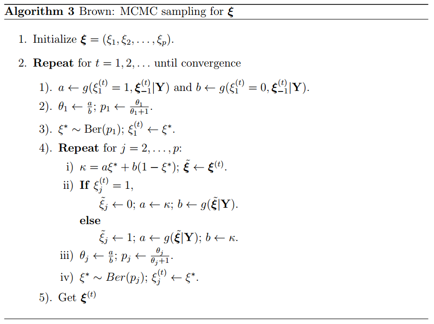

---
header-includes:
- \usepackage{amssymb}
- \usepackage{color}
- \documentclass{article}
- \usepackage{amsmath}
- \usepackage{setspace}
- \usepackage{xcolor}
- \usepackage{graphicx}
output:
pdf_document: newcommandault
html_document: newcommandault
---
\newcommand\T{{\top}}
\newcommand\ubeta{{\boldsymbol \beta}}
\newcommand\uSigma{{\boldsymbol \Sigma}}
\newcommand\uepsilon{{\boldsymbol \epsilon}}
\newcommand\umu{{\boldsymbol \mu}}
\newcommand\utheta{{\boldsymbol \theta}}
\newcommand\ubg{{\boldsymbol \gamma}}
\newcommand\uphi{{\boldsymbol \phi}}
\newcommand\uxi{{\boldsymbol \xi}}

\newcommand\0{{\bf 0}}
\newcommand\uA{{\bf A}}
\newcommand\ua{{\bf a}}
\newcommand\uB{{\bf B}}
\newcommand\ub{{\bf b}}
\newcommand\uC{{\bf C}}
\newcommand\uD{{\bf D}}
\newcommand\uE{{\bf E}}
\newcommand\ue{{\bf e}}
\newcommand\uH{{\bf H}}
\newcommand\uI{{\bf I}}
\newcommand\uK{{\bf K}}
\newcommand\uM{{\bf M}}
\newcommand\uQ{{\bf Q}}
\newcommand\uV{{\bf V}}
\newcommand\uX{{\bf X}}
\newcommand\ux{{\bf x}}
\newcommand\uY{{\bf Y}}
\newcommand\uy{{\bf y}}
\newcommand\uz{{\bf z}}
\newcommand\diag{{\rm diag}}
\newcommand{\tr}{{\text tr}}

# Multivariate Bayesian Variable Selection and Prediction

Consider a multivariate vairable regression model,
$$\uY = \uX\uB + \uE,$$
where $\uY=(\uy_1,\uy_2,\ldots,\uy_n)^{\T}$ is the $n \times q$ response matrix, $\uX = (\ux_1,\ldots,\ux_p)$ is the $n\times p$ design matrix, $\uB = (\ubeta_1,\ldots,\ubeta_p)^{\T}$ is a $p\times q$ unknown coefficient matrix, and $\uE = (\ue_1,\ue_2,\ldots,\ue_n)^{\T}$ is an $n\times q$ error matrix with $\ue_i \overset{i.i.d}{\sim}\mathcal{N}_q(\0, \uSigma)$. To identify the variables selected among $p$ regressors, [@Brown] introduced a latent binary vector $\uxi = (\xi_1,\ldots, \xi_p)^{\T}$ with
\begin{eqnarray*}
\xi_j=\begin{cases} 1 \quad &  \text{ if $\ubeta_j$ is active} \\0 \quad & \text{ if $\ubeta_j$ is not active}
\end{cases}.
\end{eqnarray*}
The conjugate priors are considered as follows:
\begin{eqnarray*}
&& \pi(\uB_{\uxi}|\uSigma,\uxi) \sim \mathcal{MN}(\0,\uH_{\uxi}, \uSigma)\\
&& \pi(\uSigma) \sim \mathcal{IW}(\uQ,\delta)\\
&& \pi(\uxi) \overset{ind}{\sim} \prod_{j=1}^{p} \text{Ber}(\omega_j),
\end{eqnarray*}
where $\uQ$, $\uH_{\uxi}$ and $\delta$ are hyperparameters. 
Then, by Bayesian theorem, the marginal posterior distribution can be obtained by
\begin{eqnarray*}
&&m(\uxi|\uY) \propto m(\uY|\uxi)\pi(\uxi)\\
&=&\iint f(\uY|\uB_{\uxi},\uSigma)\pi(\uB_{\uxi}|\uSigma, \uxi) \pi(\uSigma) d\uB d\uSigma \pi(\uxi)\\
&=&\iint (2\pi)^{-\frac{nq}{2}}|\uSigma|^{-\frac{n}{2}}\exp \left[-\frac{1}{2}\tr   \{(\uY-\uX_{\uxi}\uB_{\uxi})^{\T}(\uY-\uX_{\uxi}\uB_{\uxi})\}\uSigma^{-1} \right]\times\\
&&(2\pi)^{-\frac{|\uxi| q}{2}}|\uSigma|^{-\frac{|\uxi|}{2}} {|\uH_{\uxi}}|^{-\frac{q}{2}}\exp \left[\frac{1}{2}\tr\{\uB_{\uxi}^{\T}\uH_{\uxi}^{-1}\uB_{\uxi}\uSigma^{-1} \}  \right] \times \\
&& |\uQ|^{\frac{\delta}{2}}2^{-\frac{1}{2}\delta q}\uxi_q^{-1}(\frac{\delta}{2}) |\uSigma|^{-\frac{\delta + q + 1}{2}}\exp\{-\frac{1}{2}\tr(\uQ\uSigma^{-1}) \}d\uB_{\uxi} d\uSigma \pi(\uxi)\\
&\propto& (2\pi)^{-\frac{|\uxi| q}{2}}{|\uH_{\uxi}|}^{-\frac{q}{2}}\iint |\uSigma|^{-\frac{1}{2}(n+|\uxi|+\delta+q+1)}\exp\{-\frac{1}{2}\tr(\uQ\uSigma^{-1}) \} \\
&&\exp\left[-\frac{1}{2}\tr\left\{\left(\uB_{\uxi}^{\T}(\uX_{\uxi}^{\T}\uX_{\uxi}+\uH_{\uxi}^{-1})\uB_{\uxi}-2\uB_{\uxi}^{\T}\uX_{\uxi}^{\T}\uY\right)\uSigma^{-1}\right\}\right]\times \\
&&\exp\left[-\frac{1}{2}\tr\left\{\uY^{\T}\uY\uSigma^{-1} \right\}  \right]d\uB_{\uxi} d\uSigma \pi(\uxi)\\
&=& (2\pi)^{-\frac{|\uxi| q}{2}}{|\uH_{\uxi}|}^{-\frac{q}{2}}\iint |\uSigma|^{-\frac{1}{2}(n+|\uxi|+\delta+q+1)}\exp\{-\frac{1}{2}\tr[(\uY^{\T}\uY+\uQ)\uSigma^{-1}]\}\times \\
&&\exp\left[-\frac{1}{2}\tr\left\{\left(\uB_{\uxi}^{\T}\uK_{\uxi}\uB_{\uxi}-2\uB_{\uxi}^{\T}\uK_{\uxi}\uK_{\uxi}^{-1}\uX_{\uxi}^{\T}\uY\right)\uSigma^{-1}\right\}\right]d\uB_{\uxi} d\uSigma \pi(\uxi)\\
&=& (2\pi)^{-\frac{|\uxi| q}{2}}{|\uH_{\uxi}|}^{-\frac{q}{2}}\iint |\uSigma|^{-\frac{1}{2}(n+|\uxi|+\delta+q+1)}\times\\
&&\exp\{-\frac{1}{2}\tr[(\uY^{\T}\uY-\tilde{\uB}_{\uxi}^{\T}\uK_{\uxi}\tilde{\uB}_{\uxi} +\uQ)\uSigma^{-1}]\}\times \\
&&\exp\left[-\frac{1}{2}\tr\left\{\left( (\uB_{\uxi} - \tilde{\uB}_{\uxi})^{\T} \uK_{\uxi}(\uB_{\uxi} - \tilde{\uB}_{\uxi})\right)\uSigma^{-1}\right\}\right]d\uB_{\uxi} d\uSigma \pi(\uxi)\\
&=& (2\pi)^{-\frac{|\uxi| q}{2}}{|\uH_{\uxi}|}^{-\frac{q}{2}} (2\pi)^{\frac{|\uxi| q}{2}} |\uK_{\uxi}|^{-\frac{q}{2}} \times \\
&&\int |\uSigma|^{\frac{|\uxi|}{2}} |\uSigma|^{-\frac{1}{2}(n+|\uxi|+\delta+q+1)}\exp\{-\frac{1}{2}\tr[(\uY^{\T}\uY-\tilde{\uB}_{\uxi}^{\T}\uK_{\uxi}\tilde{\uB}_{\uxi} +\uQ)\uSigma^{-1}]\}  d\uSigma \pi(\uxi)\\
&=& {|\uH_{\uxi}|}^{-\frac{q}{2}} |\uK_{\uxi}|^{-\frac{q}{2}}
\int |\uSigma|^{-\frac{1}{2}(n+\delta+q+1)}\times\\
&&\exp\{-\frac{1}{2}\tr[(\uY^{\T}\uY-\uY^{\T}\uX_{\uxi}\uK_{\uxi}^{-1}\uX_{\uxi}^{\T}\uY +\uQ)\uSigma^{-1}]\}  d\uSigma \pi(\uxi)\\
&=& {|\uH_{\uxi}\uK_{\uxi}|}^{-\frac{q}{2}}
\int |\uSigma|^{-\frac{1}{2}(n+\delta+q+1)}\times\\
&&\exp\{-\frac{1}{2}\tr[(\uY^{\T}(\uI_n - \uX_{\uxi}\uK_{\uxi}^{-1}\uX_{\uxi}^{\T})\uY +\uQ)\uSigma^{-1}]\}  d\uSigma \pi(\uxi)\\
&\propto& {|\uH_{\uxi}\uK_{\uxi}|}^{-\frac{q}{2}}|\uY^{\T}(\uI_n - \uX_{\uxi}\uK_{\uxi}^{-1}\uX_{\uxi}^{\T})\uY +\uQ|^{-\frac{n+\delta}{2}} \pi(\uxi)\\
&\equiv&g(\uxi|\uY),
(\#eq:1)
\end{eqnarray*}
where $\uK_{\uxi} = \uX_{\uxi}^{\T}\uX_{\uxi}+\uH_{\uxi}^{-1}$ and $g(\uxi|\uY)$ is the proportional form of $\pi(\uxi|\uY)$. [@Brown] set $\uQ = k\uI_q$ and $\uH_{\uxi} = c(\uX_{\uxi}^{\T}\uX_{\uxi})^{-1}$ and $\omega_j = \omega$, then $\pi(\uxi) = \prod_{j=1}^{p}\omega_j^{\xi_j}(1-\omega_j)^{1-\xi_j} = \omega^{|\uxi|}(1-\omega)^{p-|\uxi|}$. Apply $\uQ = k\uI_q$ and $\uH_{\uxi} = c(\uX_{\uxi}^{\T}\uX_{\uxi})^{-1}$ into \@ref(eq:1), hence we have
\begin{eqnarray*}
\log g(\uxi|\uY) &=& -\frac{n+\delta}{2}\log|k\uI_{q} + \uY^{\T}\uY - \frac{c}{c+1}\uY^{\T}\uX_{\uxi}(\uX_{\uxi}^{\T}\uX_{\uxi}^{-1})\uX_{\uxi}^{\T}\uY|-\\
&&\frac{q|\uxi|}{2}\log(c+1)+ |\uxi|\log\omega+(p-|\uxi|)\log(1-\omega).
\end{eqnarray*}
Exhaustive computation of $g(\uxi|\uY)$ for $2^p$ values of $\uxi$ becomes prohibitive even in a super computer when $p$ is larger than 40. In this circumstances, using MCMC sampling to explore marginal posterior is possible. [@Brown] use Gibbs sampler to generate each $\uxi$ value component-wise from full conditional distributions $\pi(\xi_j|\uxi_{-j},\uY)$, where $\uxi_{-j} = \uxi \setminus {\xi_j}$ . It is easy to show that
\begin{eqnarray*}
\pi(\xi_j = 1|\uxi_{-j},\uY) = \frac{\theta_j}{\theta_j+1},
\end{eqnarray*}
where
\begin{eqnarray*}
\theta_j = \frac{g(\xi_j = 1, \uxi_{-j}|\uY)}{g(\xi_j = 0, \uxi_{-j}|\uY)}.
\end{eqnarray*}
The complete algorithm of [@Brown] is described in Algorithm 3:

For the hyperparameter, we follow the same setting with [@Brown], which are $\delta = 2+q, \omega = 20/p, k = 2$ and $c = 10$. Note that since our definition of inverse-wishart distribution is different from that of [@Brown], the values of $q$ and $k$ we set here are after adjustment to make them consistent with [@Brown].